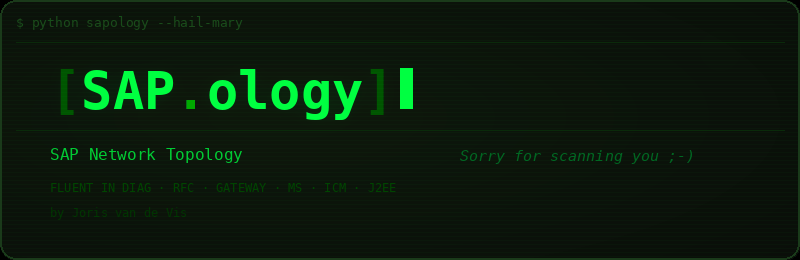

<p align="center">
  
</p>

<h1 align="center">[SAPology]</h1>
<p align="center">
  <strong>SAP Network Topology Scanner</strong><br>
  <em>The scanner that speaks SAPanese</em><br>
  Fluent in DIAG &middot; RFC &middot; Gateway &middot; MS &middot; ICM &middot; J2EE
</p>

<p align="center">
  <em>by <a href="https://github.com/kloris">Joris van de Vis</a></em>
</p>

---

SAPology is an ** security testing tool** for discovering, fingerprinting, and assessing SAP systems on a network. It combines port scanning, protocol-level fingerprinting (DIAG, RFC, Gateway, Message Server, ICM, SAPControl), and vulnerability assessment into a single self-contained scanner.

## Features

- **Two-phase discovery** - Quick pre-scan identifies SAP hosts, full scan enumerates all services
- **Protocol fingerprinting** - Native parsing of SAP DIAG, RFC, Gateway, Message Server, and ICM protocols
- **SAPControl interrogation** - Extracts SID, kernel version, instance details, and system topology via SOAP
- **Vulnerability assessment** - Checks for unprotected gateways (SAPXPG), open Message Server ports, unprotected SAPControl interfaces, SSL/TLS weaknesses, HTTP verb tampering, and known CVEs (including CVE-2025-31324)
- **ICM URL scanning** - Tests 1,600+ SAP-specific URL paths per HTTP port for exposed endpoints
- **Hail Mary mode** - Scans all RFC 1918 private subnets (~17.9M IPs) using async two-phase subnet sweeping
- **HTML & JSON reporting** - Rich interactive HTML reports and structured JSON exports
- **Desktop GUI** - Native desktop interface with real-time dashboard, severity charts, and findings browser
- **Windows standalone** - Pre-built `.exe` that runs without Python

## Quick Start

### Command-Line Scanner

```bash
# Scan a single target
python3 SAPology.py -t 192.168.1.100

# Scan a subnet with verbose output
python3 SAPology.py -t 10.0.0.0/24 -v

# Scan with HTML report output
python3 SAPology.py -t 192.168.1.0/24 -o report.html

# Scan from a target file, export JSON
python3 SAPology.py -T targets.txt --json results.json

# Skip vulnerability checks (discovery only)
python3 SAPology.py -t 192.168.1.100 --skip-vuln

# Hail Mary - scan all private subnets
python3 SAPology.py --hail-mary
```

### Desktop GUI

```bash
# Launch with native window (pywebview)
python3 SAPology_gui.py

# Launch in your default web browser
python3 SAPology_gui.py --browser
```

### Windows Standalone

Download `SAPology.exe` from the [Releases](../../releases) page and run from Command Prompt:

```cmd
SAPology.exe -t 192.168.1.100
SAPology.exe -t 10.0.0.0/24 -v -o report.html
```

No Python installation required.

## Installation

### Command-Line Scanner Prerequisites

| Requirement | Notes |
|---|---|
| **Python** | 3.7 or later |
| **requests** | HTTP library (required) |
| **rich** | Terminal formatting (optional, for progress bars) |

```bash
pip install requests rich
```

That's it. The scanner is a single file with no other dependencies.

### GUI Prerequisites

The GUI requires additional packages on top of the scanner prerequisites:

| Requirement | Notes |
|---|---|
| **bottle** | Lightweight HTTP server for the Python-JS bridge |
| **pywebview** | Native desktop window (optional, falls back to browser) |

```bash
pip install requests rich bottle pywebview
```

**pywebview system dependencies (Linux):**

On Ubuntu/Debian, pywebview requires WebKit2GTK:

```bash
sudo apt install python3-gi python3-gi-cairo gir1.2-gtk-3.0 gir1.2-webkit2-4.0
```

If pywebview is not installed or fails to load, the GUI automatically falls back to opening in your default web browser. You can also force browser mode:

```bash
python3 SAPology_gui.py --browser
```

### Building the Windows Executable

To build `SAPology.exe` yourself on a Windows machine:

1. Install Python 3.8+ from [python.org](https://python.org)
2. Place `SAPology.py` and `build_windows.bat` in the same folder
3. Double-click `build_windows.bat`
4. The executable will be created in the `dist\` folder

The batch file installs PyInstaller and all dependencies automatically.

## Supported Operating Systems

| OS | CLI Scanner | GUI (native window) | GUI (browser mode) | Standalone .exe |
|---|---|---|---|---|
| **Linux** (Ubuntu 20.04+, Debian, Kali, etc.) | Yes | Yes (with WebKit2GTK) | Yes | - |
| **macOS** | Yes | Yes | Yes | - |
| **Windows 10/11** | Yes (with Python) | Yes | Yes | Yes |
| **Windows** (no Python) | - | - | - | Yes |

## Command-Line Usage

```
usage: SAPology.py [-h] [--target TARGET] [--target-file TARGET_FILE]
                   [--instances INSTANCES] [--timeout TIMEOUT]
                   [--threads THREADS] [--output OUTPUT] [--json JSON_OUTPUT]
                   [--skip-vuln] [--skip-url-scan]
                   [--url-scan-threads URL_SCAN_THREADS]
                   [--gw-test-cmd GW_TEST_CMD] [-v] [--hail-mary]
                   [--hm-offsets HM_OFFSETS]
```

| Flag | Description |
|---|---|
| `-t`, `--target` | Target IP, hostname, or CIDR range (comma-separated) |
| `-T`, `--target-file` | File containing one target per line |
| `--instances` | SAP instance range to scan (default: `00-99`) |
| `--timeout` | Per-connection timeout in seconds (default: `3`) |
| `--threads` | Number of parallel scan threads (default: `20`) |
| `-o`, `--output` | HTML report output path |
| `--json` | JSON export output path |
| `--skip-vuln` | Skip Phase 2 vulnerability assessment |
| `--skip-url-scan` | Skip ICM URL scanning |
| `--url-scan-threads` | Threads for URL scanning (default: `25`) |
| `--gw-test-cmd` | OS command for gateway SAPXPG test (default: `id`) |
| `-v`, `--verbose` | Verbose output |
| `--hail-mary` | Scan all RFC 1918 private subnets |
| `--hm-offsets` | Custom host offsets for hail-mary subnet sampling |

## GUI Features

The desktop GUI provides a real-time dashboard with:

- **Target configuration** - IP/CIDR input, instance ranges, threading options
- **Live scan progress** - Real-time console output, progress bar, and timer
- **Dashboard view** - Summary cards, discovered systems list, severity distribution chart, findings browser
- **URL Scan view** - Dedicated tab showing all URL scan results with status code filtering and path search
- **System detail modals** - Click any system to see its ports, findings (sorted by severity), and URL scan results
- **Export** - HTML report and JSON export buttons
- **Cancellation** - Stop a running scan at any point (both Phase 1 and Phase 2)

## Disclaimer

This tool is intended for **authorized security testing and assessment only**. Only use SAPology against systems you have explicit permission to test. Unauthorized scanning of computer systems is illegal in most jurisdictions.

## License

Copyright (c) 2025-2026 Joris van de Vis. All rights reserved.

## Author

**Joris van de Vis** - SAP Security Researcher

- GitHub: [@kloris](https://github.com/kloris)


